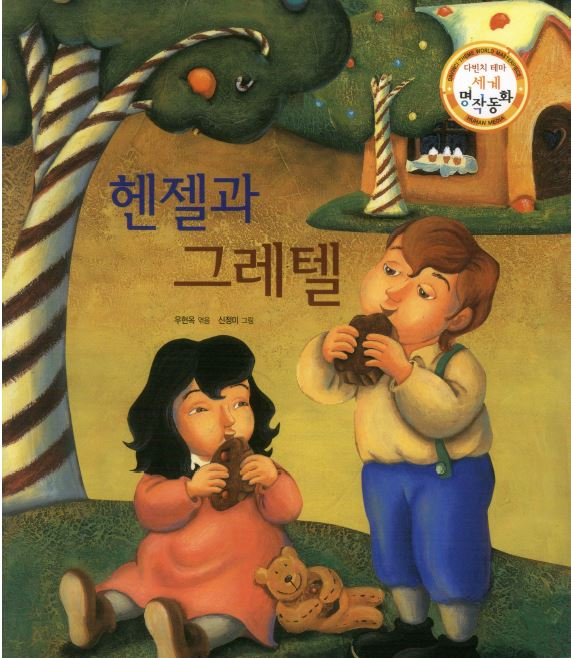

# 도서 난이도 분류

<!-- <pre><code><pre/><code/>안에 코드를 넣으면 된다 -->
| 주제 |이 프로젝트의 데이터는 저작권문제로 다운로드 불가| 코드주소 |
|------|-----|----------|
|도서 분류||[도서 난이도 분류(LSTM)](https://github.com/kwong3528/Book-Difficulty-Classification/blob/master/%EC%B1%85%EC%9D%84%20%EB%82%9C%EC%9D%B4%EB%8F%84%EB%A1%9C%20%EB%B6%84%EB%A5%98%ED%95%B4%EB%B3%B4%EC%9E%90/%EC%9E%84%EB%B2%A0%EB%94%A9_%EC%B5%9C%EC%A2%85%EB%B3%B8.ipynb) / [도서 난이도 분류 최종본](https://github.com/kwong3528/Book-Difficulty-Classification/blob/master/%EC%B1%85%EC%9D%84%20%EB%82%9C%EC%9D%B4%EB%8F%84%EB%A1%9C%20%EB%B6%84%EB%A5%98%ED%95%B4%EB%B3%B4%EC%9E%90/%EB%8F%84%EC%84%9C%20%EB%82%9C%EC%9D%B4%EB%8F%84%20%EB%B6%84%EB%A5%98%20%EC%B5%9C%EC%A2%85%EB%B3%B8.ipynb)|

#### 이 프로젝트는 250권가량의 유치원,초등학생이 읽을 수 있는 책들의 데이터를 이용하여 1~10까지 난이도로 분류를 시도해보았다.
#### 그래도 학습이 제대로 이루어지지 않아 5진분류로 폭을 좁혔다.

#### 실제로 학습을 시켜보니 난이도에 따른 데이터들의 대표성을 찾기가 어려워 과적합이 일어나는 것으로 보인다.

#### 데이터가 부족하여 딥러닝모델(LSTM)을 사용한 학습이 제대로 이루어 지지않아 그외에 모델을 분류모델로 사용하였다.

---

# 국민청원 데이터로 이진분류를 해보자.
<!-- <pre><code><pre/><code/>안에 코드를 넣으면 된다 -->
| 주제 |이 프로젝트의 데이터는 저작권문제로 다운로드 불가| 코드주소 |
|------|-----|----------|
|청원 분류||[pandas 공부](https://github.com/kwong3528/Classification/blob/master/%EA%B5%AD%EB%AF%BC%EC%B2%AD%EC%9B%90%20%EB%B6%84%EB%A5%98/Pandas%EB%A1%9C_%EA%B5%AD%EB%AF%BC%EC%B2%AD%EC%9B%90_%EB%8D%B0%EC%9D%B4%ED%84%B0_%EB%B6%84%EC%84%9D.ipynb) /   [청원  분류](https://github.com/kwong3528/Classification/blob/master/%EA%B5%AD%EB%AF%BC%EC%B2%AD%EC%9B%90%20%EB%B6%84%EB%A5%98/%EA%B5%AD%EB%AF%BC%EC%B2%AD%EC%9B%90_%EB%8D%B0%EC%9D%B4%ED%84%B0%EB%A1%9C_%EC%9D%B4%EC%A7%84%EB%B6%84%EB%A5%98_%ED%95%98%EA%B8%B0.ipynb) / [청원 카테고리 분류](https://github.com/kwong3528/Classification/blob/master/%EA%B5%AD%EB%AF%BC%EC%B2%AD%EC%9B%90%20%EB%B6%84%EB%A5%98/%EA%B5%AD%EB%AF%BC%EC%B2%AD%EC%9B%90_%EB%8D%B0%EC%9D%B4%ED%84%B0%EB%A1%9C_%EC%B2%AD%EC%9B%90_%EC%B9%B4%ED%85%8C%EA%B3%A0%EB%A6%AC_%EB%B6%84%EB%A5%98%ED%95%98%EA%B8%B0.ipynb)|

+ 국민청원 데이터로 평균투표수를 이상을 받을 과 그렇지못한것을 분류를 해보는 것입니다.
+ 데이터의 출처는 https://github.com/akngs/petitions 이 곳입니다.
